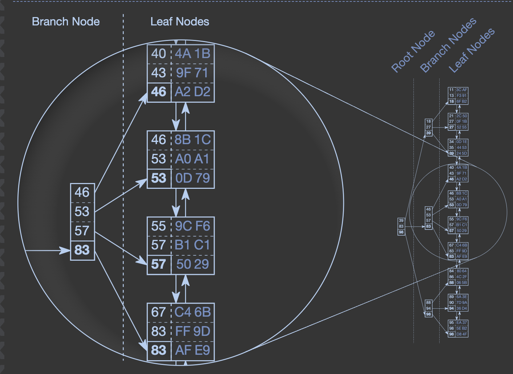

```{=html}
<style>
/* ══════════════════════════════════════════════
   RESET & BASE
══════════════════════════════════════════════ */
*, *::before, *::after { box-sizing: border-box; margin: 0; padding: 0; }

body {
  font-family: 'Inter', system-ui, -apple-system, sans-serif;
  background: #f0f5ff;
  color: #1e293b;
  overflow-x: hidden;
  line-height: 1.6;
}

/* Kill Quarto containers */
main.content, #quarto-content, .page-columns,
.page-columns .content, .content, #quarto-document-content,
.quarto-title-block { max-width: none !important; width: 100% !important; margin: 0 !important; padding: 0 !important; }
.quarto-title-block { display: none; }

/* ── PROGRESS BAR ── */
#progress-bar {
  position: fixed; top: 0; left: 0; height: 3px;
  background: linear-gradient(90deg, #2563eb, #38bdf8, #6366f1);
  width: 0%; z-index: 9999;
}

/* ── SIDE NAV ── */
#side-nav {
  position: fixed; right: 1.4rem; top: 50%; transform: translateY(-50%);
  display: flex; flex-direction: column; gap: 0.55rem; z-index: 999;
}
.nav-dot {
  width: 9px; height: 9px; border-radius: 50%;
  background: #bfdbfe; border: 1.5px solid #93c5fd;
  cursor: pointer; transition: all 0.25s; position: relative;
}
.nav-dot:hover, .nav-dot.active { background: #2563eb; transform: scale(1.5); border-color: #2563eb; }
.nav-tip {
  position: absolute; right: 1.5rem; top: 50%; transform: translateY(-50%);
  background: #1e3a5f; color: #e0f2fe; padding: 0.2rem 0.55rem;
  border-radius: 5px; font-size: 0.7rem; white-space: nowrap;
  opacity: 0; pointer-events: none; transition: opacity 0.18s;
}
.nav-dot:hover .nav-tip { opacity: 1; }

/* ══════════════════════════════════════════════
   HERO — rich blue, stays dark for contrast
══════════════════════════════════════════════ */
.hero {
  min-height: 100vh; display: flex; align-items: center; justify-content: center;
  text-align: center; padding: 4rem 2rem; position: relative; overflow: hidden;
  background: linear-gradient(135deg, #1d4ed8 0%, #2563eb 45%, #1e40af 100%);
}
.hero-grid-bg {
  position: absolute; inset: 0; z-index: 0;
  background-image:
    linear-gradient(rgba(255,255,255,0.07) 1px, transparent 1px),
    linear-gradient(90deg, rgba(255,255,255,0.07) 1px, transparent 1px);
  background-size: 48px 48px;
}
.hero-glow {
  position: absolute; width: 600px; height: 600px; border-radius: 50%;
  background: radial-gradient(circle, rgba(255,255,255,0.12) 0%, transparent 70%);
  top: 50%; left: 50%; transform: translate(-50%,-50%); z-index: 0;
}
.hero-inner { position: relative; z-index: 1; max-width: 820px; }
.hero-eyebrow {
  display: inline-flex; align-items: center; gap: 0.5rem;
  background: rgba(255,255,255,0.15); border: 1px solid rgba(255,255,255,0.3);
  color: #dbeafe; padding: 0.35rem 1rem; border-radius: 999px;
  font-size: 0.74rem; letter-spacing: 0.14em; text-transform: uppercase;
  margin-bottom: 2rem;
}
.hero h1 {
  font-size: clamp(3rem, 7vw, 6rem); font-weight: 900; color: #ffffff;
  line-height: 0.95; letter-spacing: -0.04em; margin-bottom: 1.8rem;
}
.hero h1 em { color: #bfdbfe; font-style: normal; }
.hero-sub {
  font-size: 1.1rem; color: rgba(255,255,255,0.75); max-width: 600px; margin: 0 auto 3.5rem;
  line-height: 1.75;
}
.hero-pills { display: flex; gap: 0.6rem; justify-content: center; flex-wrap: wrap; margin-bottom: 3rem; }
.hero-pill {
  padding: 0.45rem 1.1rem; border-radius: 999px; font-size: 0.8rem;
  font-weight: 600; border: 1px solid;
}
.hero-pill-1 { background: rgba(255,255,255,0.15); border-color: rgba(255,255,255,0.35); color: #dbeafe; }
.hero-pill-2 { background: rgba(56,189,248,0.2);  border-color: rgba(56,189,248,0.5);  color: #e0f7ff; }
.hero-pill-3 { background: rgba(167,139,250,0.2); border-color: rgba(167,139,250,0.4); color: #ede9fe; }
.hero-pill-4 { background: rgba(52,211,153,0.18); border-color: rgba(52,211,153,0.4);  color: #d1fae5; }
.hero-scroll-cue {
  color: rgba(255,255,255,0.55); font-size: 0.75rem; letter-spacing: 0.12em;
  text-transform: uppercase; animation: bob 2s ease-in-out infinite;
}
.hero-scroll-cue span { display: block; font-size: 1.6rem; color: #bfdbfe; margin-top: 0.3rem; }
@keyframes bob { 0%,100%{transform:translateY(0)} 50%{transform:translateY(8px)} }

/* ══════════════════════════════════════════════
   CHAPTER INTROS — light blue strips
══════════════════════════════════════════════ */
.chapter-intro {
  padding: 5rem 4rem 3rem;
  border-top: 3px solid #2563eb;
  display: flex; align-items: flex-end; gap: 3rem;
  background: linear-gradient(180deg, #dbeafe 0%, #f0f5ff 100%);
}
.chapter-intro .ch-num {
  font-size: clamp(5rem,10vw,9rem); font-weight: 900; line-height: 1;
  color: rgba(37,99,235,0.13); letter-spacing: -0.06em; flex-shrink: 0;
}
.chapter-intro .ch-text .ch-tag {
  font-size: 0.72rem; text-transform: uppercase; letter-spacing: 0.16em;
  color: #2563eb; font-weight: 700; margin-bottom: 0.5rem;
}
.chapter-intro .ch-text h2 {
  font-size: clamp(2rem,4vw,3.2rem); font-weight: 800; color: #1e3a8a;
  letter-spacing: -0.03em; line-height: 1.1;
}
.chapter-intro .ch-text p {
  color: #475569; font-size: 1rem; line-height: 1.7; max-width: 60ch; margin-top: 0.8rem;
}

/* ══════════════════════════════════════════════
   STICKY SCROLLY LAYOUT
══════════════════════════════════════════════ */
.sticky-scrolly {
  display: flex;
  background: #f0f5ff;
}
.sticky-left {
  position: sticky; top: 0; height: 100vh;
  width: 50%; flex-shrink: 0;
  display: flex; align-items: center; justify-content: center;
  padding: 2.5rem;
  border-right: 1px solid #bfdbfe;
  background: #e8f0fe;
  overflow: hidden;
}
.sticky-right {
  flex: 1; padding: 0 3.5rem 20vh 3.5rem;
  background: #f8faff;
}

/* Visual panels inside sticky-left */
.sticky-panel {
  position: absolute; inset: 0;
  display: flex; align-items: center; justify-content: center; padding: 2.5rem;
  opacity: 0; transition: opacity 0.45s ease, transform 0.45s ease;
  transform: translateY(16px);
  pointer-events: none;
}
.sticky-panel.active {
  opacity: 1; transform: translateY(0); pointer-events: auto;
}

/* Step blocks in sticky-right */
.step {
  min-height: 80vh; display: flex; flex-direction: column; justify-content: center;
  padding: 5rem 0;
  border-bottom: 1px solid #e2e8f0;
  opacity: 0.3; transition: opacity 0.4s;
}
.step.is-active { opacity: 1; }
.step:last-child { border-bottom: none; }
.step-tag {
  font-size: 0.7rem; text-transform: uppercase; letter-spacing: 0.18em;
  color: #2563eb; font-weight: 700; margin-bottom: 0.8rem;
}
.step h3 {
  font-size: clamp(1.5rem, 2.5vw, 2.1rem); font-weight: 800; color: #0f172a;
  letter-spacing: -0.02em; line-height: 1.15; margin-bottom: 1.1rem;
}
.step p { color: #334155; font-size: 1rem; line-height: 1.8; margin-bottom: 0.9rem; }
.step p:last-of-type { margin-bottom: 1.2rem; }
.step code {
  background: #dbeafe; border: 1px solid #93c5fd;
  color: #1d4ed8; padding: 0.1em 0.4em; border-radius: 4px; font-size: 0.88em;
}

/* ══════════════════════════════════════════════
   BADGES
══════════════════════════════════════════════ */
.badge-row { display: flex; flex-wrap: wrap; gap: 0.45rem; margin-top: 0.8rem; }
.badge {
  padding: 0.28rem 0.75rem; border-radius: 999px; font-size: 0.73rem;
  font-weight: 600; letter-spacing: 0.03em; border: 1px solid;
}
.bi { background: #dbeafe; color: #1d4ed8; border-color: #93c5fd; }
.bs { background: #e0f7ff; color: #0369a1; border-color: #7dd3fc; }
.bg { background: #dcfce7; color: #15803d; border-color: #86efac; }
.ba { background: #fef9c3; color: #a16207; border-color: #fde047; }
.br { background: #fee2e2; color: #b91c1c; border-color: #fca5a5; }
.bp { background: #ede9fe; color: #6d28d9; border-color: #c4b5fd; }

/* ══════════════════════════════════════════════
   SQL CODE BLOCKS — dark navy, only dark element
══════════════════════════════════════════════ */
.sql-block {
  background: #0f1e3d; border: 1px solid #2d4a7a;
  border-radius: 12px; padding: 1.2rem 1.5rem;
  font-family: 'Fira Code','Cascadia Code','Courier New',monospace;
  font-size: 0.82rem; line-height: 1.75; color: #e2e8f0;
  margin: 1rem 0; overflow-x: auto;
  box-shadow: 0 4px 20px rgba(15,30,61,0.2);
}
.sql-block .kw { color: #93c5fd; font-weight: 600; }
.sql-block .ty { color: #67e8f9; }
.sql-block .fn { color: #6ee7b7; }
.sql-block .st { color: #fbbf24; }
.sql-block .cm { color: #64748b; font-style: italic; }

/* ══════════════════════════════════════════════
   VISUALS — TABLE
══════════════════════════════════════════════ */
.vis-table {
  width: 100%; border-collapse: collapse;
  border-radius: 12px; overflow: hidden;
  box-shadow: 0 4px 20px rgba(37,99,235,0.12);
  font-size: 0.85rem;
}
.vis-table th {
  background: #2563eb; color: #fff; padding: 0.65rem 1rem;
  font-weight: 700; text-align: left; font-size: 0.75rem;
  letter-spacing: 0.08em; text-transform: uppercase;
}
.vis-table td {
  padding: 0.6rem 1rem; border-bottom: 1px solid #e2e8f0;
  color: #334155; background: #ffffff;
}
.vis-table tr:last-child td { border-bottom: none; }
.vis-table tr:nth-child(even) td { background: #f0f5ff; }
.pk { color: #2563eb; font-weight: 700; }
.fk { color: #0369a1; font-weight: 700; }

/* ══════════════════════════════════════════════
   VISUALS — RELATIONSHIP DIAGRAM
══════════════════════════════════════════════ */
.rel-wrap {
  width: 100%; display: flex; flex-direction: column; gap: 1.2rem;
}
.rel-tables-row {
  display: flex; gap: 1.5rem; align-items: flex-start;
}
.rel-box {
  flex: 1; background: #ffffff; border-radius: 12px; overflow: hidden;
  border: 1px solid #bfdbfe;
  box-shadow: 0 4px 16px rgba(37,99,235,0.1);
}
.rel-head {
  padding: 0.6rem 1rem; font-size: 0.78rem; font-weight: 700;
  letter-spacing: 0.07em; text-transform: uppercase;
}
.rel-head.ind { background: #2563eb; color: #fff; }
.rel-head.pur { background: #7c3aed; color: #fff; }
.rel-field {
  padding: 0.45rem 1rem; font-size: 0.8rem; color: #475569;
  border-bottom: 1px solid #f1f5f9;
  display: flex; align-items: center; gap: 0.5rem;
}
.rel-field:last-child { border-bottom: none; }
.pk-badge {
  font-size: 0.62rem; background: #dbeafe;
  color: #1d4ed8; padding: 0.1rem 0.4rem; border-radius: 4px; font-weight: 700;
}
.fk-badge {
  font-size: 0.62rem; background: #e0f7ff;
  color: #0369a1; padding: 0.1rem 0.4rem; border-radius: 4px; font-weight: 700;
}
.rel-connector {
  display: flex; flex-direction: column; align-items: center;
  justify-content: center; gap: 0.2rem; padding: 0 0.3rem;
  font-size: 0.65rem; color: #2563eb; font-weight: 700;
  text-transform: uppercase; letter-spacing: 0.08em; white-space: nowrap;
}

/* ══════════════════════════════════════════════
   VISUALS — INDEX COMPARISON
══════════════════════════════════════════════ */
.idx-compare {
  width: 100%; display: flex; gap: 1rem; align-items: flex-start;
}
.idx-col { flex: 1; }
.idx-col-label {
  font-size: 0.68rem; text-transform: uppercase; letter-spacing: 0.12em;
  color: #64748b; font-weight: 700; margin-bottom: 0.5rem; text-align: center;
}
.idx-row {
  background: #ffffff; border: 1px solid #e2e8f0;
  border-radius: 8px; padding: 0.5rem 0.8rem; margin-bottom: 0.35rem;
  font-size: 0.8rem; color: #475569; display: flex; align-items: center; gap: 0.5rem;
  box-shadow: 0 1px 3px rgba(0,0,0,0.04);
}
.idx-row .rn { color: #94a3b8; font-size: 0.7rem; }
.idx-row.sorted { background: #ede9fe; border-color: #c4b5fd; color: #5b21b6; font-weight: 600; }
.idx-arrow-mid {
  display: flex; align-items: center; font-size: 1.5rem; color: #2563eb;
  padding-top: 1.5rem;
}

/* ══════════════════════════════════════════════
   VISUALS — B+ TREE SVG WRAPPER
══════════════════════════════════════════════ */
.btree-container {
  width: 100%; padding: 1rem;
  background: #eef4ff; border: 1px solid #bfdbfe;
  border-radius: 16px; box-shadow: 0 4px 20px rgba(37,99,235,0.1);
}
.btree-container svg { width: 100%; height: auto; overflow: visible; }

/* Tree node fills — kept readable on light bg */
.tn-root rect   { fill: #1e3a8a; stroke: #60a5fa; stroke-width: 2; }
.tn-root text   { fill: #dbeafe; font-weight: 700; font-size: 11px; }
.tn-branch rect { fill: #ede9fe; stroke: #a78bfa; stroke-width: 1.5; }
.tn-branch text { fill: #5b21b6; font-weight: 600; font-size: 10px; }
.tn-leaf rect   { fill: #dcfce7; stroke: #4ade80; stroke-width: 1.5; }
.tn-leaf text   { fill: #15803d; font-weight: 600; font-size: 10px; }
.tn-active rect { fill: #fef9c3; stroke: #f59e0b; stroke-width: 2.5; }
.tn-active text { fill: #92400e; }
.t-edge { stroke: #2563eb; stroke-width: 1.5; fill: none; }
.t-link { stroke: #16a34a; stroke-width: 1.5; stroke-dasharray: 4 3; fill: none; }
.t-path { stroke: #f59e0b; stroke-width: 3; fill: none; }

/* ══════════════════════════════════════════════
   SCAN VISUAL
══════════════════════════════════════════════ */
.scan-grid {
  display: grid; grid-template-columns: repeat(5, 1fr); gap: 0.35rem;
}
.scan-cell {
  aspect-ratio: 1; border-radius: 6px; display: flex; align-items: center;
  justify-content: center; font-size: 0.65rem; font-weight: 600;
  border: 1px solid #e2e8f0; color: #94a3b8;
  background: #ffffff; transition: all 0.3s;
}
.scan-cell.checked { background: #fee2e2; border-color: #fca5a5; color: #b91c1c; }
.scan-cell.found   { background: #dcfce7; border-color: #86efac; color: #15803d; font-size: 0.8rem; }

/* ══════════════════════════════════════════════
   TRAVERSAL STEPS
══════════════════════════════════════════════ */
.trav-steps { display: flex; flex-direction: column; gap: 0.6rem; width: 100%; }
.trav-step {
  display: flex; gap: 0.9rem; align-items: flex-start;
  background: #ffffff; border: 1px solid #e2e8f0;
  border-radius: 10px; padding: 0.75rem 1rem;
  transition: all 0.3s;
  box-shadow: 0 1px 4px rgba(0,0,0,0.04);
}
.trav-step.active-step {
  background: #dbeafe; border-color: #93c5fd;
}
.trav-num {
  width: 26px; height: 26px; border-radius: 50%; background: #2563eb;
  color: #fff; font-size: 0.7rem; font-weight: 800; flex-shrink: 0;
  display: flex; align-items: center; justify-content: center;
}
.trav-text { font-size: 0.83rem; color: #334155; line-height: 1.5; }
.trav-text strong { color: #1d4ed8; }

/* ══════════════════════════════════════════════
   TRADEOFF + CHECKLIST VISUALS
══════════════════════════════════════════════ */
.trade-grid { display: grid; grid-template-columns: 1fr 1fr; gap: 0.8rem; width: 100%; }
.trade-card { border-radius: 12px; padding: 1rem 1.1rem; border: 1px solid; }
.trade-card.pro { background: #f0fdf4; border-color: #86efac; }
.trade-card.con { background: #fff7ed; border-color: #fed7aa; }
.trade-card h4 { font-size: 0.75rem; font-weight: 700; text-transform: uppercase; letter-spacing: 0.1em; margin-bottom: 0.6rem; }
.trade-card.pro h4 { color: #15803d; }
.trade-card.con h4 { color: #c2410c; }
.trade-card ul { padding-left: 1.1rem; font-size: 0.8rem; color: #475569; }
.trade-card li { margin-bottom: 0.25rem; }

.checklist { display: flex; flex-direction: column; gap: 0.45rem; width: 100%; }
.check-item {
  display: flex; gap: 0.7rem; align-items: flex-start;
  background: #ffffff; border: 1px solid #e2e8f0;
  border-radius: 9px; padding: 0.65rem 0.9rem; font-size: 0.82rem; color: #334155;
  box-shadow: 0 1px 3px rgba(0,0,0,0.04);
}
.check-icon { flex-shrink: 0; margin-top: 0.05rem; }

/* ══════════════════════════════════════════════
   COMPOSITE INDEX VISUAL
══════════════════════════════════════════════ */
.comp-list { display: flex; flex-direction: column; gap: 0.3rem; width: 100%; }
.comp-row {
  display: flex; border-radius: 7px; overflow: hidden;
  border: 1px solid #e2e8f0; font-size: 0.78rem;
}
.comp-a { background: #dbeafe; color: #1d4ed8; padding: 0.4rem 0.75rem; font-weight: 700; }
.comp-b { background: #f0f9ff; color: #0369a1; padding: 0.4rem 0.75rem; flex: 1; }

/* ══════════════════════════════════════════════
   FULL-WIDTH INTERLUDE — solid blue accent
══════════════════════════════════════════════ */
.interlude {
  padding: 6rem 4rem; display: flex; align-items: center; justify-content: center;
  background: #1d4ed8;
}
.interlude-inner { max-width: 700px; text-align: center; }
.interlude-inner .int-label {
  font-size: 0.72rem; text-transform: uppercase; letter-spacing: 0.18em;
  color: #bfdbfe; font-weight: 700; margin-bottom: 1rem;
}
.interlude-inner .int-quote {
  font-size: clamp(1.3rem,2.5vw,2rem); font-weight: 700; color: #ffffff;
  line-height: 1.4; margin-bottom: 1rem;
}
.interlude-inner .int-sub { font-size: 0.95rem; color: rgba(255,255,255,0.7); line-height: 1.7; }

/* ══════════════════════════════════════════════
   SUMMARY / FINAL
══════════════════════════════════════════════ */
.final-section {
  padding: 8rem 4rem;
  background: linear-gradient(180deg, #dbeafe 0%, #f0f5ff 100%);
  border-top: 3px solid #2563eb;
}
.final-section h2 {
  font-size: clamp(2rem,4vw,3.5rem); font-weight: 900; color: #1e3a8a;
  letter-spacing: -0.03em; margin-bottom: 3rem; text-align: center;
}
.final-section h2 span { color: #2563eb; }
.takeaway-grid {
  display: grid; grid-template-columns: repeat(auto-fill, minmax(300px,1fr));
  gap: 1rem; max-width: 1200px; margin: 0 auto;
}
.tk-card {
  background: #ffffff; border: 1px solid #bfdbfe;
  border-radius: 14px; padding: 1.5rem 1.6rem;
  transition: border-color 0.25s, transform 0.25s, box-shadow 0.25s;
  box-shadow: 0 2px 8px rgba(37,99,235,0.06);
}
.tk-card:hover { border-color: #2563eb; transform: translateY(-2px); box-shadow: 0 8px 24px rgba(37,99,235,0.12); }
.tk-num { font-size: 2.2rem; font-weight: 900; color: #bfdbfe; line-height:1; margin-bottom:0.7rem; }
.tk-card p { color: #475569; font-size: 0.9rem; line-height: 1.7; }
.tk-card p strong { color: #1d4ed8; }

/* ══════════════════════════════════════════════
   SELECTIVITY VISUAL
══════════════════════════════════════════════ */
.sel-bars { width: 100%; display: flex; flex-direction: column; gap: 0.7rem; }
.sel-row { display: flex; flex-direction: column; gap: 0.3rem; }
.sel-label { font-size: 0.75rem; color: #64748b; display: flex; justify-content: space-between; }
.sel-track { height: 10px; background: #e2e8f0; border-radius: 999px; overflow: hidden; }
.sel-fill { height: 100%; border-radius: 999px; transition: width 1s ease; }
.sel-fill.hi { background: linear-gradient(90deg, #2563eb, #38bdf8); }
.sel-fill.lo { background: linear-gradient(90deg, #ef4444, #f97316); }

/* ══════════════════════════════════════════════
   RESPONSIVE
══════════════════════════════════════════════ */
@media(max-width:900px){
  .sticky-scrolly { flex-direction: column; }
  .sticky-left { position: relative; height: 50vh; width: 100%; border-right: none; border-bottom: 1px solid #bfdbfe; }
  .sticky-panel { position: relative; opacity: 1; transform: none; }
  .sticky-panel:not(.active){ display: none; }
  .sticky-right { padding: 2rem 1.5rem; }
  .chapter-intro { padding: 3rem 1.5rem 2rem; flex-direction: column; gap: 1rem; }
  .chapter-intro .ch-num { font-size: 4rem; }
  .rel-tables-row { flex-direction: column; }
  .idx-compare { flex-direction: column; }
  .trade-grid { grid-template-columns: 1fr; }
  #side-nav { display: none; }
  .interlude { padding: 3rem 1.5rem; }
  .final-section { padding: 4rem 1.5rem; }
}
</style>

<!-- ═══════════ CHROME ═══════════ -->
<div id="progress-bar"></div>
<div id="side-nav"></div>

<!-- ═══════════════════════════════════════════════════
     HERO
════════════════════════════════════════════════════ -->
<section class="hero" id="sec-hero">
  <div class="hero-grid-bg"></div>
  <div class="hero-glow"></div>
  <div class="hero-inner">
    <div class="hero-eyebrow">● SQL Database Essentials</div>
    <h1>SQL, Keys,<br>Indexes &amp;<br><em>B+ Trees</em></h1>
    <p class="hero-sub">What is SQL? What are its primary features? How does it Index? How does a tree structures power billions of queries per second.</p>
    <div class="hero-pills">
      <span class="hero-pill hero-pill-1">SQL Foundations</span>
      <span class="hero-pill hero-pill-2">Keys &amp; Constraints</span>
      <span class="hero-pill hero-pill-3">Index Structures</span>
      <span class="hero-pill hero-pill-4">B+ Tree Internals</span>
    </div>
    <div class="hero-scroll-cue">Scroll to explore<span>↓</span></div>
  </div>
</section>

<!-- ═══════════════════════════════════════════════════
     CHAPTER 1 INTRO
════════════════════════════════════════════════════ -->
<div class="chapter-intro" id="sec-ch1">
  <div class="ch-num">01</div>
  <div class="ch-text">
    <div class="ch-tag">Foundations</div>
    <h2>What is SQL &amp; how do tables work?</h2>
    <p>SQL is the language of relational databases. Instead of storing everything in one spreadsheet or file, SQL stores related pieces of information in separate tables. Queries combine those tables only when needed.</p>
  </div>
</div>

<!-- ═══════════════════════════════════════════════════
     STICKY SECTION 1 — SQL Basics + Tables + Relationships
     Left panel swaps between 3 visuals as you scroll steps
════════════════════════════════════════════════════ -->
<div class="sticky-scrolly" id="scrolly-1" data-chapter="1">

  <!-- STICKY LEFT -->
  <div class="sticky-left" id="left-1">

    <!-- Panel A: students table -->
    <div class="sticky-panel active" id="panel-1-0">
      <div style="width:100%">
        <div style="font-size:0.7rem;text-transform:uppercase;letter-spacing:0.14em;color:#6366f1;font-weight:700;margin-bottom:0.8rem;">students table</div>
        <table class="vis-table">
          <thead><tr><th>student_id</th><th>name</th><th>major</th><th>year</th></tr></thead>
          <tbody>
            <tr><td class="pk">1001</td><td>Alex</td><td>CS</td><td>Sophomore</td></tr>
            <tr><td class="pk">1002</td><td>Maria</td><td>Math</td><td>Junior</td></tr>
            <tr><td class="pk">1003</td><td>Sam</td><td>CS</td><td>Sophomore</td></tr>
            <tr><td class="pk">1004</td><td>Nina</td><td>Physics</td><td>Senior</td></tr>
          </tbody>
        </table>
        <div style="margin-top:1.2rem;" class="sql-block">
<span class="kw">SELECT</span> <span class="fn">name</span>, <span class="fn">major</span><br>
<span class="kw">FROM</span> <span class="fn">students</span><br>
<span class="kw">WHERE</span> year = <span class="st">'Sophomore'</span>;
        </div>
      </div>
    </div>

    <!-- Panel B: relationship diagram -->
    <div class="sticky-panel" id="panel-1-1">
      <div class="rel-wrap" style="width:100%">
        <div class="rel-tables-row">
          <div class="rel-box">
            <div class="rel-head ind">students</div>
            <div class="rel-field"><span class="pk-badge">PK</span><span class="pk">student_id</span></div>
            <div class="rel-field">name</div>
            <div class="rel-field">major</div>
            <div class="rel-field">year</div>
          </div>
          <div class="rel-connector">
            <span>student_id</span>
            <span style="font-size:1.4rem;">↔</span>
            <span>links</span>
          </div>
          <div class="rel-box">
            <div class="rel-head pur">enrollments</div>
            <div class="rel-field"><span class="pk-badge">PK</span><span class="pk">enroll_id</span></div>
            <div class="rel-field"><span class="fk-badge">FK</span><span class="fk">student_id</span></div>
            <div class="rel-field">course_id</div>
            <div class="rel-field">grade</div>
          </div>
        </div>
        <table class="vis-table" style="font-size:0.78rem;">
          <thead><tr><th>enroll_id</th><th>student_id</th><th>course_id</th></tr></thead>
          <tbody>
            <tr><td class="pk">E001</td><td class="fk">1001</td><td>CS301</td></tr>
            <tr><td class="pk">E002</td><td class="fk">1001</td><td>CS401</td></tr>
            <tr><td class="pk">E003</td><td class="fk">1003</td><td>CS301</td></tr>
          </tbody>
        </table>
      </div>
    </div>

<!-- Panel C: keys SQL -->
    <div class="sticky-panel" id="panel-1-2">
      <div style="width:100%">
        <div style="font-size:0.7rem;text-transform:uppercase;letter-spacing:0.14em;color:#2563eb;font-weight:700;margin-bottom:0.8rem;">Defining keys in SQL</div>
        <div class="sql-block" style="font-size:0.79rem;">
<span class="kw">CREATE TABLE</span> <span class="fn">students</span> (<br>
&nbsp;&nbsp;student_id &nbsp;<span class="ty">INT</span> <span class="kw">PRIMARY KEY</span>,<br>
&nbsp;&nbsp;name &nbsp;&nbsp;&nbsp;&nbsp;&nbsp;&nbsp;&nbsp;<span class="ty">VARCHAR</span>(100),<br>
&nbsp;&nbsp;major &nbsp;&nbsp;&nbsp;&nbsp;&nbsp;<span class="ty">VARCHAR</span>(100)<br>
);<br><br>
<span class="kw">CREATE TABLE</span> <span class="fn">enrollments</span> (<br>
&nbsp;&nbsp;enrollment_id <span class="ty">INT</span> <span class="kw">PRIMARY KEY</span>,<br>
&nbsp;&nbsp;student_id &nbsp;&nbsp;&nbsp;<span class="ty">INT</span>,<br>
&nbsp;&nbsp;course_id &nbsp;&nbsp;&nbsp;<span class="ty">INT</span>,<br>
&nbsp;&nbsp;<span class="kw">FOREIGN KEY</span> (student_id)<br>
&nbsp;&nbsp;&nbsp;&nbsp;<span class="kw">REFERENCES</span> <span class="fn">students</span>(student_id)<br>
);<br><br>
<span class="cm">-- Add a primary key after creation:</span><br>
<span class="kw">ALTER TABLE</span> <span class="fn">students</span><br>
<span class="kw">ADD PRIMARY KEY</span> (student_id);<br><br>
<span class="cm">-- Add a foreign key after creation:</span><br>
<span class="kw">ALTER TABLE</span> <span class="fn">enrollments</span><br>
<span class="kw">ADD CONSTRAINT</span> fk_student<br>
<span class="kw">FOREIGN KEY</span> (student_id)<br>
<span class="kw">REFERENCES</span> <span class="fn">students</span>(student_id);
        </div>
        <div style="display:grid;grid-template-columns:1fr 1fr;gap:0.6rem;margin-top:0.8rem;">
          <div style="background:#dbeafe;border:1px solid #93c5fd;border-radius:9px;padding:0.7rem 0.8rem;">
            <div style="font-size:0.65rem;font-weight:700;text-transform:uppercase;letter-spacing:0.1em;color:#1d4ed8;margin-bottom:0.35rem;">PRIMARY KEY</div>
            <div style="font-size:0.75rem;color:#1e3a8a;line-height:1.5;">Defined at table creation <em>or</em> added later with <code style="background:#bfdbfe;border-radius:3px;padding:0.05em 0.3em;font-size:0.9em;">ALTER TABLE</code></div>
          </div>
          <div style="background:#e0f7ff;border:1px solid #7dd3fc;border-radius:9px;padding:0.7rem 0.8rem;">
            <div style="font-size:0.65rem;font-weight:700;text-transform:uppercase;letter-spacing:0.1em;color:#0369a1;margin-bottom:0.35rem;">FOREIGN KEY</div>
            <div style="font-size:0.75rem;color:#0c4a6e;line-height:1.5;">Defined at table creation or added later with <code style="background:#bae6fd;border-radius:3px;padding:0.05em 0.3em;font-size:0.9em;">ADD CONSTRAINT</code></div>
          </div>
        </div>
      </div>
    </div>

  </div><!-- /sticky-left -->

  <!-- SCROLL STEPS RIGHT -->
  <div class="sticky-right">

    <div class="step" data-panel="1-0">
      <div class="step-tag">1.1 · SQL Foundations</div>
      <h3>SQL is declarative and remote</h3>
      <p><strong style="color:#8a00c2;">SQL</strong> (Structured Query Language) lets you create, query, update, and manage relational databases. A relational database stores data in <em style="color:#8a00c2;">tables</em> — rows are records, columns are attributes/variables.</p>
      <p>The key insight: SQL is <strong style="color:#8a00c2;">declarative</strong>. You specify what data you want; the database engine's optimizer figures out how to retrieve it efficiently. This is why the same SQL query can run substantially faster with an index than without.</p>
      <p>SQL queries are sent to a server (SQL server) where the database is stored, though this server is often remote, that doesn't have to be the case. SQL handles everything in executing the query and returns the resulting data to the user.</p>
      <p>On the left is an example of a SQL query on the table <em style="color:#8a00c2;">students</em> that retreives the name and major of Sophmore students in the table.<p>
      <div class="badge-row">
        <span class="badge bi">Declarative</span>
        <span class="badge bs">Relational</span>
        <span class="badge bg">Structured</span>
        <span class="badge bp">Query Language</span>
      </div>
    </div>

    <div class="step" data-panel="1-1">
      <div class="step-tag">1.2 · Tables &amp; Relationships</div>
      <h3>Relational aspect of SQL and Keys</h3>
      <p>A <strong style="8a00c2;">table</strong> represents an entity — students, courses, orders. Each row is one record; each column is one attribute. A <strong style="color:#8a00c2;">primary key</strong> uniquely identifies each row.</p>
      <p>A <strong style="color:#8a00c2;">primary key</strong> must be unique and never NULL. Most tables have one primary key, though composite keys (multiple columns) are valid and identify rows through a composition of multiple columns.</p>
      <p>Relational databases become powerful when multiple tables are <em style="color:#8a00c2;">connected</em>. To do this: A <strong style="color:#8a00c2;">foreign key</strong> is a column that references another table's primary key. A foreign key doesn't have to be made up of unique values but it does need to reference a primary key (which is made up of unique values). It enforces <em style="color:#8a00c2;">referential integrity</em> — you cannot enroll a student who doesn't exist. The database prevents the inconsistency at the constraint level.<p>
      <p>The <code>student_id</code> column bridges the <strong style="color:#8a00c2;">students</strong> and <strong style="color:#8a00c2;">enrollments</strong> tables which enables powerful joins without redundancy. A foreign key defines and enforces a relationship between tables.</p>
      <div class="badge-row">
        <span class="badge bi">Entities</span>
        <span class="badge bs">Attributes</span>
        <span class="badge bg">No Duplication</span>
        <span class="badge ba">Joins</span>
      </div>
    </div>

    <div class="step" data-panel="1-2">
      <div class="step-tag">1.3 · Primary &amp; Foreign Keys</div>
      <h3>How to create keys in context</h3>
      <p>On the left is the SQL command for creating primary and foreign keys in a SQL database.<p>
      <p>The <code>CREATE TABLE</code> command is used when one creates the key at the same time as creating the SQL table itself.<p>
      <p>The <code>ALTER TABLE</code> command is used when the table was already created but has no pre-defined key. For a <strong style="color:#8a00c2;">primary key</strong> within the query one would use <code>ADD PRIMARY KEY</code> and for a <strong style="color:#8a00c2;">foreign key</strong> within the query one would use <code>ADD CONSTRAINT</code> and must specify the constraint is a foreign key and the primary key that the foreign key references.<p>
      <p>Common confusion: a foreign key is simply <em>a column in your table</em>. The relationship is established from by declaring it as a reference to another table's primary key with a <code>FOREIGN KEY</code> constraint.</p>
      <div class="badge-row">
        <span class="badge bi">Unique</span>
        <span class="badge br">Not NULL</span>
        <span class="badge bg">Referential Integrity</span>
        <span class="badge bp">Composite Keys</span>
      </div>
    </div>

  </div><!-- /sticky-right -->
</div><!-- /scrolly-1 -->

<!-- ═══════════ INTERLUDE ═══════════ -->
<div class="interlude">
  <div class="interlude-inner">
    <div class="int-label">Key insight</div>
    <div class="int-quote">Keys define relationships. Indexes make those relationships fast to query.</div>
    <div class="int-sub">A primary key is a logical constraint (a column). An index is the underlying data structure the database mainatains to turn a key lookup from O(n) into O(log n). They coexist but are fundamentally different things.</div>
  </div>
</div>

<!-- ═══════════════════════════════════════════════════
     CHAPTER 2 INTRO
════════════════════════════════════════════════════ -->
<div class="chapter-intro" id="sec-ch2">
  <div class="ch-num">02</div>
  <div class="ch-text">
    <div class="ch-tag">Performance Structures</div>
    <h2>Indexes</h2>
    <p>An index is a separate ordered data structure that helps the database find rows faster by storing indexed column values and references to the corresponding table rows.</p>
  </div>
</div>

<!-- ═══════════════════════════════════════════════════
     STICKY SECTION 2 — Indexes
════════════════════════════════════════════════════ -->
<div class="sticky-scrolly" id="scrolly-2" data-chapter="2">

  <div class="sticky-left" id="left-2">

    <!-- Panel: physical vs index order -->
    <div class="sticky-panel active" id="panel-2-0">
      <div style="width:100%">
        <div style="font-size:0.7rem;text-transform:uppercase;letter-spacing:0.14em;color:#6366f1;font-weight:700;margin-bottom:0.8rem;">Physical rows vs. Index order</div>
        <div class="idx-compare">
          <div class="idx-col">
            <div class="idx-col-label">Physical table</div>
            <div class="idx-row"><span class="rn">Row 1</span> Tom</div>
            <div class="idx-row"><span class="rn">Row 2</span> Alex</div>
            <div class="idx-row"><span class="rn">Row 4</span> Nina</div>
            <div class="idx-row"><span class="rn">Row 7</span> Maria</div>
            <div class="idx-row"><span class="rn">Row 9</span> Sam</div>
          </div>
          <div class="idx-arrow-mid">→</div>
          <div class="idx-col">
            <div class="idx-col-label">Index on name</div>
            <div class="idx-row sorted">Alex → Row 2</div>
            <div class="idx-row sorted">Maria → Row 7</div>
            <div class="idx-row sorted">Nina → Row 4</div>
            <div class="idx-row sorted">Sam → Row 9</div>
            <div class="idx-row sorted">Tom → Row 1</div>
          </div>
        </div>
        <div style="margin-top:1rem;" class="sql-block" style="font-size:0.79rem;">
<span class="kw">CREATE INDEX</span> idx_name<br>
&nbsp;&nbsp;<span class="kw">ON</span> <span class="fn">students</span>(name);<br><br>
<span class="kw">CREATE INDEX</span> idx_enroll_student<br>
&nbsp;&nbsp;<span class="kw">ON</span> <span class="fn">enrollments</span>(student_id);
        </div>
      </div>
    </div>

    <!-- Panel: full scan vs index lookup -->
    <div class="sticky-panel" id="panel-2-1">
      <div style="width:100%">
        <div style="font-size:0.7rem;text-transform:uppercase;letter-spacing:0.14em;color:#ef4444;font-weight:700;margin-bottom:0.6rem;">❌ Full table scan (no index)</div>
        <div class="scan-grid" id="scan-cells"></div>
        <div style="font-size:0.75rem;color:#64748b;margin:0.7rem 0 1.2rem;">Every row checked. Complexity: O(n).</div>
        <div style="font-size:0.7rem;text-transform:uppercase;letter-spacing:0.14em;color:#6ee7b7;font-weight:700;margin-bottom:0.6rem;">✅ Index lookup</div>
        <div style="display:flex;align-items:center;gap:0.6rem;flex-wrap:wrap;margin-bottom:0.5rem;">
          <div style="background:rgba(99,102,241,0.2);border:1px solid rgba(99,102,241,0.4);border-radius:8px;padding:0.4rem 0.8rem;font-size:0.8rem;color:#a5b4fc;font-weight:600;">Root</div>
          <span style="color:#6366f1;">→</span>
          <div style="background:rgba(124,58,237,0.2);border:1px solid rgba(124,58,237,0.4);border-radius:8px;padding:0.4rem 0.8rem;font-size:0.8rem;color:#c4b5fd;font-weight:600;">Branch</div>
          <span style="color:#6366f1;">→</span>
          <div style="background:rgba(52,211,153,0.15);border:1px solid rgba(52,211,153,0.4);border-radius:8px;padding:0.4rem 0.8rem;font-size:0.8rem;color:#6ee7b7;font-weight:600;">Leaf</div>
          <span style="color:#f59e0b;">→</span>
          <div style="background:rgba(245,158,11,0.2);border:1px solid rgba(245,158,11,0.5);border-radius:8px;padding:0.4rem 0.8rem;font-size:0.8rem;color:#fcd34d;font-weight:700;">Match!</div>
        </div>
        <div style="display:grid;grid-template-columns:1fr 1fr;gap:0.6rem;margin-top:0.5rem;">
          <div style="background:rgba(239,68,68,0.1);border-radius:10px;padding:0.7rem;text-align:center;border:1px solid rgba(239,68,68,0.25);">
            <div style="font-size:1.5rem;font-weight:800;color:#f87171;">O(n)</div>
            <div style="font-size:0.72rem;color:#64748b;">Full scan</div>
          </div>
          <div style="background:rgba(52,211,153,0.1);border-radius:10px;padding:0.7rem;text-align:center;border:1px solid rgba(52,211,153,0.25);">
            <div style="font-size:1.5rem;font-weight:800;color:#6ee7b7;">O(log n)</div>
            <div style="font-size:0.72rem;color:#64748b;">Index lookup</div>
          </div>
        </div>
      </div>
    </div>

    <!-- Panel: tradeoffs -->
    <div class="sticky-panel" id="panel-2-2">
      <div style="width:100%">
        <div style="font-size:0.7rem;text-transform:uppercase;letter-spacing:0.14em;color:#6366f1;font-weight:700;margin-bottom:0.8rem;">Index tradeoffs</div>
        <div class="trade-grid" style="margin-bottom:1rem;">
          <div class="trade-card pro">
            <h4>✅ Reads</h4>
            <ul><li>Faster WHERE</li><li>Faster JOINs</li><li>Efficient ORDER BY</li><li>Fast range queries</li></ul>
          </div>
          <div class="trade-card con">
            <h4>⚠️ Writes</h4>
            <ul><li>Slower INSERT</li><li>Slower UPDATE</li><li>Slower DELETE</li><li>Extra storage</li></ul>
          </div>
        </div>
        <!-- selectivity bars -->
        <div style="font-size:0.7rem;text-transform:uppercase;letter-spacing:0.12em;color:#6366f1;font-weight:700;margin-bottom:0.6rem;">Selectivity matters</div>
        <div class="sel-bars">
          <div class="sel-row">
            <div class="sel-label"><span>email = 'x@example.com'</span><span style="color:#6ee7b7;">High ✓</span></div>
            <div class="sel-track"><div class="sel-fill hi" style="width:3%"></div></div>
            <div style="font-size:0.7rem;color:#475569;">Matches ~1 row of millions</div>
          </div>
          <div class="sel-row">
            <div class="sel-label"><span>status = 'active'</span><span style="color:#f87171;">Low ✗</span></div>
            <div class="sel-track"><div class="sel-fill lo" style="width:60%"></div></div>
            <div style="font-size:0.7rem;color:#475569;">Matches 60% of rows — index barely helps</div>
          </div>
          <div class="sel-row">
            <div class="sel-label"><span>country = 'US'</span><span style="color:#fb923c;">Medium</span></div>
            <div class="sel-track"><div class="sel-fill lo" style="width:28%"></div></div>
            <div style="font-size:0.7rem;color:#475569;">Depends on data distribution</div>
          </div>
        </div>
      </div>
    </div>

  </div><!-- /sticky-left -->

  <div class="sticky-right">

    <div class="step" data-panel="2-0">
      <div class="step-tag">2.1 · What is an Index</div>
      <h3>An index is a sorted, separate access structure</h3>
      <p>An <strong style="color:#8a00c2;">index</strong> is a separate data structure — like a phonebook or a textbook's back index — that helps the database find rows without reading every single one.</p>
      <p>The physical rows in a table can be in any order. An index stores keys in <em style="color:#8a00c2;">sorted logical order</em> with references (row pointers) to where those rows actually live. The table itself doesn't move.</p>
      <p>Important: a <strong style="color:#8a00c2;">key</strong> is a logical constraint (unique, not null). An <strong style="color:#8a00c2;">index</strong> is a physical performance structure. Primary keys usually get an index automatically in MySQL/InnoDB — but the concepts are distinct.</p>
      <div class="badge-row">
        <span class="badge bi">Sorted Keys</span>
        <span class="badge bs">Row References</span>
        <span class="badge bg">Separate Structure</span>
        <span class="badge ba">Faster Lookup</span>
      </div>
    </div>

    <div class="step" data-panel="2-1">
      <div class="step-tag">2.2 · Why Indexes Help</div>
      <h3>Advantage: Prevents scanning every row, by following a guided path</h3>
      <p>Without an index on email, finding <code>WHERE email = 'x@example.com'</code> requires inspecting every row — a <em style="color:#f87171;">full table scan</em>. With millions of rows this leads to computing inefficiencies and prolonged runtimes.</p>
      <p>With an index, the database follows an ordered tree path — root → branch → leaf — touching only a handful of nodes to land on the match. Essentially, an index cuts down the total number of comparisons needed to identify a row. This is the difference between O(n), which is the runtime without an index, and O(log n) which is the decreased runtime through an index.</p>
      <p>Indexes are most impactful for <code>WHERE</code> filters, <code>JOIN</code> conditions, <code>ORDER BY</code> sorting, and range queries like <code>BETWEEN</code>. Below the structure and functionality of an index is explained in depth.</p>
      <div class="badge-row">
        <span class="badge bi">WHERE clauses</span>
        <span class="badge bs">JOIN conditions</span>
        <span class="badge bg">ORDER BY</span>
        <span class="badge bp">Range queries</span>
      </div>
    </div>

    <div class="step" data-panel="2-2">
      <div class="step-tag">2.3 · Limitations &amp; Tradeoffs</div>
      <h3>Indexes not always fast and beneficial</h3>
      <p>Indexes speed up reads but slow down writes. Every <code>INSERT</code>, <code>UPDATE</code>, or <code>DELETE</code> must also update every relevant index which causes the structure of the index to alter. Too many indexes increase maintenance cost and storage of the database.</p>
      <p><strong style="color:#8a00c2;">Selectivity</strong> is critical. An index on a column with few distinct values (like a boolean <code>is_active</code> or <code>status</code>) may not help — too many rows match, and the database may choose a full scan anyway since that may be more efficient.</p>
      <p> Although primary keys must be unique by definition, a regular index (created with CREATE INDEX) has no uniqueness requirement at all. Sometimes, regular indexes can be helpful to speed up row retrieval and querying even if they aren't for primary keys. It is still important to consider selectivity or uniqueness when creating a regular index, as an index on a column with low selectivity may not provide performance benefits and can even degrade performance due to the overhead of maintaining the index and the potential for increased table lookups.
        
      <p>Even with a perfect index, a query can still be slow if it matches many rows (leaf scanning) or those rows are scattered across many storage pages and has to perform many table lookups. Table lookups happen when the database engine jumps from the index back to the main table to retrieve a full row of data after finding a match in the index. This is not a problem in MySQL because the table data lives directly in the primary key's B+ tree leaves (clustered index), so there's no second trip. Secondary indexes, however, (on non-primary-key columns) always require a second lookup back to the primary key tree to get the full row.</p>
      <div class="badge-row">
        <span class="badge br">Write overhead</span>
        <span class="badge ba">Low selectivity</span>
        <span class="badge bp">Leaf scanning</span>
        <span class="badge bs">Table lookups</span>
      </div>
    </div>

  </div>
</div><!-- /scrolly-2 -->

<!-- ═══════════ INTERLUDE 2 ═══════════ -->
<div class="interlude">
  <div class="interlude-inner">
    <div class="int-label">So what structure does an index use?</div>
    <div class="int-quote">Most database indexes are B trees. MySQL uses B+ trees which are a balanced tree structure designed for disk-based storage with high fanout and sorted leaf chains.</div>
    <div class="int-sub">Understanding the tree explains why indexes are fast for both equality lookups and range queries, and why they stay efficient even with millions of rows.</div>
  </div>
</div>

<!-- ═══════════════════════════════════════════════════
     CHAPTER 3 INTRO
════════════════════════════════════════════════════ -->
<div class="chapter-intro" id="sec-ch3">
  <div class="ch-num">03</div>
  <div class="ch-text">
    <div class="ch-tag">Data Structures</div>
    <h2>B+ Trees</h2>
    <p>The tree structure that makes indexes fast and optimized in MySQL.</p>
  </div>
</div>

<!-- ═══════════════════════════════════════════════════
     STICKY SECTION 3 — B+ Trees
     Left panel: the same tree SVG, JS highlights different nodes per step
════════════════════════════════════════════════════ -->
<div class="sticky-scrolly" id="scrolly-3" data-chapter="3">

  <div class="sticky-left" id="left-3">

    <!-- One tree panel: screenshot image -->
    <div class="sticky-panel active" id="panel-3-tree">
      <div style="width:100%;display:flex;flex-direction:column;gap:0.8rem;">
        <div style="font-size:0.7rem;text-transform:uppercase;letter-spacing:0.14em;color:#2563eb;font-weight:700;">
          B+ Tree Structure
        </div>
        <div style="background:#eef4ff;border:1px solid #bfdbfe;border-radius:16px;overflow:hidden;box-shadow:0 4px 20px rgba(37,99,235,0.1);">
          
        </div>
        <div style="font-size:0.75rem;color:#475569;line-height:1.5;background:#dbeafe;border-radius:8px;padding:0.6rem 0.8rem;border:1px solid #93c5fd;">
          Root node (top) → branch nodes (middle) → leaf nodes (bottom, linked in sorted order)
        </div>
      </div>
    </div>

    <!-- Traversal panel: separate highlighted path tree -->
    <div class="sticky-panel" id="panel-3-traversal">
      <div style="width:100%">
        <div style="font-size:0.7rem;text-transform:uppercase;letter-spacing:0.14em;color:#f59e0b;font-weight:700;margin-bottom:0.8rem;">Search path for key 57</div>
        <div class="btree-container">
          <svg viewBox="0 0 400 230" xmlns="http://www.w3.org/2000/svg" font-family="'Fira Code',monospace">
            <defs>
              <marker id="ao2" markerWidth="6" markerHeight="6" refX="5" refY="3" orient="auto">
                <path d="M0,0 L0,6 L6,3z" fill="#f59e0b"/>
              </marker>
              <marker id="ag2" markerWidth="6" markerHeight="6" refX="5" refY="3" orient="auto">
                <path d="M0,0 L0,6 L6,3z" fill="#4338ca"/>
              </marker>
            </defs>
            <!-- Non-highlighted edges -->
            <line x1="165" y1="38" x2="65"  y2="82" stroke="#1e293b" stroke-width="1.5"/>
            <line x1="235" y1="38" x2="295" y2="82" stroke="#1e293b" stroke-width="1.5"/>
            <!-- Highlighted edge root→branch -->
            <line x1="200" y1="38" x2="200" y2="82" stroke="#f59e0b" stroke-width="3" marker-end="url(#ao2)"/>
            <!-- Non-highlighted branch edges -->
            <line x1="170" y1="108" x2="65" y2="155" stroke="#1e293b" stroke-width="1.5"/>
            <line x1="230" y1="108" x2="290" y2="155" stroke="#1e293b" stroke-width="1.5"/>
            <!-- Highlighted edge branch→leaf -->
            <line x1="200" y1="108" x2="200" y2="155" stroke="#f59e0b" stroke-width="3" marker-end="url(#ao2)"/>

            <!-- Root (active) -->
            <g class="tn-active"><rect x="130" y="8" width="140" height="30" rx="6"/><text x="200" y="28" text-anchor="middle" font-size="11" fill="#fcd34d" font-weight="700">39 | 83 | 98</text></g>
            <!-- Branches -->
            <g class="tn-branch"><rect x="20"  y="82" width="80"  height="26" rx="5"/><text x="60"  y="99" text-anchor="middle">&lt; 39</text></g>
            <g class="tn-active"><rect x="145" y="82" width="110" height="26" rx="5"/><text x="200" y="99" text-anchor="middle" font-size="10" fill="#fcd34d" font-weight="700">46|53|57|83</text></g>
            <g class="tn-branch"><rect x="280" y="82" width="100" height="26" rx="5"/><text x="330" y="99" text-anchor="middle">83-98</text></g>
            <!-- Leaves -->
            <g class="tn-leaf"><rect x="20"  y="155" width="90" height="26" rx="5"/><text x="65"  y="173" text-anchor="middle">42|48|51</text></g>
            <g class="tn-active"><rect x="145" y="155" width="110" height="26" rx="5"/><text x="200" y="173" text-anchor="middle" font-size="10" fill="#fcd34d" font-weight="700">55 | 57 | 57</text></g>
            <g class="tn-leaf"><rect x="280" y="155" width="95"  height="26" rx="5"/><text x="327" y="173" text-anchor="middle">61|72|79</text></g>
            <!-- Found ring -->
            <circle cx="200" cy="168" r="20" fill="none" stroke="#f59e0b" stroke-width="2" stroke-dasharray="4 3"/>
            <text x="200" y="215" text-anchor="middle" font-size="9" fill="#f59e0b" font-weight="700">KEY 57 FOUND ✓</text>
          </svg>
        </div>
        <div class="trav-steps" style="margin-top:0.8rem;">
          <div class="trav-step active-step"><div class="trav-num">1</div><div class="trav-text"><strong>Root</strong> [39|83|98]: 57 &gt; 39 and &lt; 83 → middle pointer</div></div>
          <div class="trav-step active-step"><div class="trav-num">2</div><div class="trav-text"><strong>Branch</strong> [46|53|57|83]: 57 = 57 → leaf pointer</div></div>
          <div class="trav-step active-step"><div class="trav-num">3</div><div class="trav-text"><strong>Leaf</strong> [55|57|57]: key found, return row reference</div></div>
        </div>
      </div>
    </div>

    <!-- Panel: efficiency / fanout -->
    <div class="sticky-panel" id="panel-3-fanout">
      <div style="width:100%">
        <div style="font-size:0.7rem;text-transform:uppercase;letter-spacing:0.14em;color:#6366f1;font-weight:700;margin-bottom:0.8rem;">Why B+ trees stay shallow</div>
        <div style="background:rgba(52,211,153,0.08);border:1px solid rgba(52,211,153,0.2);border-radius:12px;padding:1rem;margin-bottom:1rem;text-align:center;">
          <div style="font-size:0.75rem;color:#64748b;text-transform:uppercase;letter-spacing:0.1em;">Fanout of 100 → 3 levels covers</div>
          <div style="font-size:2.5rem;font-weight:900;color:#6ee7b7;">1,000,000</div>
          <div style="font-size:0.85rem;color:#4ade80;">leaf entries with only 3 page reads</div>
        </div>
        <!-- fanout illustration -->
        <div style="display:flex;flex-direction:column;align-items:center;gap:0.4rem;width:100%;">
          <div style="display:flex;gap:0.4rem;justify-content:center;">
            <div style="background:rgba(99,102,241,0.3);border:1px solid rgba(99,102,241,0.5);border-radius:6px;padding:0.3rem 0.8rem;font-size:0.72rem;color:#a5b4fc;font-weight:700;">ROOT</div>
          </div>
          <div style="color:#4338ca;font-size:0.85rem;">↓ × many pointers</div>
          <div style="display:flex;gap:0.3rem;flex-wrap:wrap;justify-content:center;">
            <div style="background:rgba(124,58,237,0.2);border:1px solid rgba(124,58,237,0.3);border-radius:5px;padding:0.2rem 0.5rem;font-size:0.65rem;color:#c4b5fd;">Br</div>
            <div style="background:rgba(124,58,237,0.2);border:1px solid rgba(124,58,237,0.3);border-radius:5px;padding:0.2rem 0.5rem;font-size:0.65rem;color:#c4b5fd;">Br</div>
            <div style="background:rgba(124,58,237,0.2);border:1px solid rgba(124,58,237,0.3);border-radius:5px;padding:0.2rem 0.5rem;font-size:0.65rem;color:#c4b5fd;">Br</div>
            <div style="background:rgba(124,58,237,0.2);border:1px solid rgba(124,58,237,0.3);border-radius:5px;padding:0.2rem 0.5rem;font-size:0.65rem;color:#c4b5fd;">...</div>
          </div>
          <div style="color:#4338ca;font-size:0.85rem;">↓ × many pointers</div>
          <div style="display:flex;gap:0.3rem;flex-wrap:wrap;justify-content:center;">
            <div style="background:rgba(52,211,153,0.15);border:1px solid rgba(52,211,153,0.3);border-radius:5px;padding:0.2rem 0.5rem;font-size:0.65rem;color:#6ee7b7;">Lf</div>
            <div style="background:rgba(52,211,153,0.15);border:1px solid rgba(52,211,153,0.3);border-radius:5px;padding:0.2rem 0.5rem;font-size:0.65rem;color:#6ee7b7;">Lf</div>
            <div style="background:rgba(52,211,153,0.15);border:1px solid rgba(52,211,153,0.3);border-radius:5px;padding:0.2rem 0.5rem;font-size:0.65rem;color:#6ee7b7;">Lf</div>
            <div style="background:rgba(52,211,153,0.15);border:1px solid rgba(52,211,153,0.3);border-radius:5px;padding:0.2rem 0.5rem;font-size:0.65rem;color:#6ee7b7;">Lf</div>
            <div style="background:rgba(52,211,153,0.15);border:1px solid rgba(52,211,153,0.3);border-radius:5px;padding:0.2rem 0.5rem;font-size:0.65rem;color:#6ee7b7;">...</div>
          </div>
        </div>
        <div style="margin-top:1rem;display:grid;grid-template-columns:1fr 1fr;gap:0.6rem;">
          <div style="background:rgba(99,102,241,0.12);border:1px solid rgba(99,102,241,0.2);border-radius:9px;padding:0.65rem;text-align:center;">
            <div style="font-size:1.1rem;font-weight:800;color:#a5b4fc;">Equality</div>
            <div style="font-size:0.72rem;color:#64748b;">Root → leaf in O(log n)</div>
          </div>
          <div style="background:rgba(52,211,153,0.1);border:1px solid rgba(52,211,153,0.2);border-radius:9px;padding:0.65rem;text-align:center;">
            <div style="font-size:1.1rem;font-weight:800;color:#6ee7b7;">Range</div>
            <div style="font-size:0.72rem;color:#64748b;">Walk sorted leaf chain</div>
          </div>
        </div>
      </div>
    </div>

  </div><!-- /sticky-left -->

  <div class="sticky-right">

    <div class="step" data-panel="3-tree" data-highlight="root">
      <div class="step-tag">3.1 · B+ Tree Structure</div>
      <h3>Root, branches, leaves</h3>
      <p>A <strong style="color:#8a00c2;">B+ tree</strong> has three node types. The <em style="color:#818cf8;">root</em> at the top is the entry point for every search. <em style="color:#c4b5fd;">Branch nodes</em> in the middle store only keys and pointers — they guide the search but hold no row data. <em style="color:#6ee7b7;">Leaf nodes</em> at the bottom store the actual index entries and row references.</p>
      <p>In MySQL/InnoDB, the primary key index is <strong style="color:#8a00c2;">clustered</strong> — the actual table row data lives in the leaf nodes of the primary key B+ tree. Secondary indexes store the indexed column value plus the corresponding primary key, requiring a second tree lookup to retrieve the full row.</p>
      <div class="badge-row">
        <span class="badge bi">Root node</span>
        <span class="badge bp">Branch nodes</span>
        <span class="badge bg">Leaf nodes</span>
        <span class="badge ba">Clustered index</span>
      </div>
    </div>

    <div class="step" data-panel="3-tree" data-highlight="leaves">
      <div class="step-tag">3.2 · Leaf Chain</div>
      <h3>Leaf nodes are linked for range scans</h3>
      <p>One of the key advantages of B+ trees over regular binary trees: <strong style="color:#8a00c2;">leaf nodes are linked left-to-right in sorted order</strong>. This dashed green chain in the diagram is what enables efficient range queries.</p>
      <p>To answer <code>WHERE score BETWEEN 43 AND 67</code>, the database traverses the tree to find 43, then simply walks the leaf chain to collect everything up to 67 — no re-traversal needed.</p>
      <div class="badge-row">
        <span class="badge bg">Sorted chain</span>
        <span class="badge bs">Range scans</span>
        <span class="badge bi">BETWEEN</span>
        <span class="badge bp">ORDER BY</span>
      </div>
    </div>

    <div class="step" data-panel="3-traversal">
      <div class="step-tag">3.3 · Tree Traversal</div>
      <h3>Tree traversal walk-through</h3>
      <p>Consider the task where the goal is to search for a key <strong style="color:#fcd34d;">57</strong>: start at the root <code>[39|83|98]</code>. Since 57 is between 39 and 83, follow the middle pointer. At branch <code>[46|53|57|83]</code>, find the position of 57 and follow to the leaf <code>[55|57|57]</code>. Found.</p>
      <p>Notice that only <strong style="color:#8a00c2;">one node is visited per level</strong>. This is always true for any key lookup in a B+ tree, regardless of the key or the size of the data. At each node, the search key is compared against the stored keys and exactly one pointer is followed downward. The result is that the number of nodes inspected is always exactly equal to the depth of the tree. This is where the O(log n) runtime comes from: each level cuts the search space by the branching factor, and the tree's depth grows only logarithmically with the number of rows.</p>
      <div class="badge-row">
        <span class="badge ba">O(log n)</span>
        <span class="badge bi">One path</span>
        <span class="badge bg">Exact lookup</span>
      </div>
    </div>

    <div class="step" data-panel="3-fanout">
      <div class="step-tag">3.4 · Efficiency &amp; Fanout</div>
      <h3>Shallow trees handle millions of rows in 3–4 reads</h3>
      <p>Each node in a B+ tree corresponds to one <strong style="color:#8a00c2;">page</strong> (typically 16 KB in MySQL/InnoDB). Because a page can hold hundreds of keys, the <em style="color:#8a00c2;">fanout</em> — the number of entries per node — is very high.</p>
      <p>With fanout 100: level 1 (root) covers 100 branches. Level 2 covers 10,000. Level 3 covers 1,000,000 leaves. Therefore, a tree covering a million rows reads only 3 pages for any lookup. That's why B+ trees scale so well.</p>
      <p>The tree is always <strong style="color:#8a00c2;">balanced</strong> — all leaf nodes sit at the same depth — because insertions and deletions trigger automatic node splits and merges that propagate up the tree to maintain this property. This guarantees predictable search time regardless of which key you look up.</p>
      <div class="badge-row">
        <span class="badge bi">Efficient</span>
        <span class="badge bg">Always balanced</span>
        <span class="badge ba">Predictable</span>
      </div>
    </div>


 <div class="step" data-panel="3-fanout">
      <div class="step-tag">3.4 · Efficiency &amp; Fanout</div>
      <h3>Index structures differ across SQL dialects</h3>
      <p>MySQL primarily uses B+ trees to structure its indexes, but other dialects treat indexing slightly differently. For example, PostgreSQL and SQLite default to B tree indexing, where (among other differences) row data is stored in all levels of the tree rather than just in the leaves. In Postgres, it is also possible to manually choose alternative indexing strategies like hash (simple and efficient for equality comparisons) or GiST operating classes (for geometric data and nearest-neighbor queries). Generally, though, understanding the structure of B and B+ trees is essential to creating and working with indexes in SQL.  </p>
      <div class="badge-row">
        <span class="badge bi">B vs. B+ trees</span>
        <span class="badge bg">Manual index structure selection</span>
      </div>
    </div>

  </div>
</div><!-- /scrolly-3 -->

<!-- ═══════════════════════════════════════════════════
     CHAPTER 4 INTRO
════════════════════════════════════════════════════ -->
<div class="chapter-intro" id="sec-ch4">
  <div class="ch-num">04</div>
  <div class="ch-text">
    <div class="ch-tag">Best Practices</div>
    <h2>Practical indexing: What to take away from indexing</h2>
    <p>Knowing the theory behind indexes can be helpful but only if you know how to utilize the information for your own good.</p>
  </div>
</div>

<!-- ═══════════════════════════════════════════════════
     STICKY SECTION 4 — Practical guidelines
════════════════════════════════════════════════════ -->
<div class="sticky-scrolly" id="scrolly-4" data-chapter="4">

  <div class="sticky-left" id="left-4">

    <!-- Panel: composite index visual -->
    <div class="sticky-panel active" id="panel-4-0">
      <div style="width:100%">
        <div style="font-size:0.7rem;text-transform:uppercase;letter-spacing:0.14em;color:#6366f1;font-weight:700;margin-bottom:0.8rem;">Composite index: (customer_id, order_date)</div>
        <div class="comp-list" style="margin-bottom:1rem;">
          <div style="font-size:0.68rem;color:#475569;margin-bottom:0.3rem;">Sorted by customer_id first, then order_date within each customer:</div>
          <div class="comp-row"><div class="comp-a">cust: 1</div><div class="comp-b">2024-01-05</div></div>
          <div class="comp-row"><div class="comp-a">cust: 1</div><div class="comp-b">2024-03-12</div></div>
          <div class="comp-row"><div class="comp-a">cust: 1</div><div class="comp-b">2024-07-01</div></div>
          <div class="comp-row"><div class="comp-a">cust: 2</div><div class="comp-b">2024-02-18</div></div>
          <div class="comp-row"><div class="comp-a">cust: 2</div><div class="comp-b">2024-09-30</div></div>
          <div style="text-align:center;color:#94a3b8;font-size:1rem;letter-spacing:0.15em;padding:0.2rem 0;">· · ·</div>

          <div class="comp-row" style="border:1px solid rgba(245,158,11,0.5);">
            <div class="comp-a" style="background:rgba(245,158,11,0.25);color:#475569;">cust: 10</div>
            <div class="comp-b" style="background:rgba(245,158,11,0.1);color:#475569;">2024-01-09 ← found</div>
          </div>
        </div>
        <div class="sql-block" style="font-size:0.78rem;">
<span class="kw">CREATE INDEX</span> idx_cust_date<br>
&nbsp;&nbsp;<span class="kw">ON</span> <span class="fn">orders</span>(customer_id, order_date);<br><br>
<span class="kw">EXPLAIN</span><br>
<span class="kw">SELECT</span> * <span class="kw">FROM</span> <span class="fn">orders</span><br>
<span class="kw">WHERE</span> customer_id = <span class="st">10</span><br>
<span class="kw">ORDER BY</span> order_date;
        </div>
      </div>
    </div>

    <!-- Panel: OLTP vs OLAP comparison -->
    <div class="sticky-panel" id="panel-4-1">
      <div style="width:100%">

        <!-- Header -->
        <div style="font-size:0.7rem;text-transform:uppercase;letter-spacing:0.14em;color:#2563eb;font-weight:700;margin-bottom:1rem;">
          SQL indexes: OLTP vs OLAP
        </div>

        <!-- Two column comparison -->
        <div style="display:grid;grid-template-columns:1fr 1fr;gap:0.7rem;margin-bottom:1rem;">

          <!-- OLTP -->
          <div style="background:#dbeafe;border:2px solid #2563eb;border-radius:12px;padding:1rem;">
            <div style="font-size:0.68rem;font-weight:800;text-transform:uppercase;letter-spacing:0.12em;color:#1d4ed8;margin-bottom:0.6rem;">
              ✅ OLTP
            </div>
            <div style="font-size:0.72rem;font-weight:700;color:#1e3a8a;margin-bottom:0.5rem;">Transactional</div>
            <div style="display:flex;flex-direction:column;gap:0.35rem;">
              <div style="background:#ffffff;border-radius:6px;padding:0.4rem 0.6rem;font-size:0.75rem;color:#1e3a8a;">Finds few specific rows</div>
              <div style="background:#ffffff;border-radius:6px;padding:0.4rem 0.6rem;font-size:0.75rem;color:#1e3a8a;">B+ tree skips most data</div>
              <div style="background:#ffffff;border-radius:6px;padding:0.4rem 0.6rem;font-size:0.75rem;color:#1e3a8a;">Joins on foreign keys</div>
              <div style="background:#ffffff;border-radius:6px;padding:0.4rem 0.6rem;font-size:0.75rem;color:#1e3a8a;">WHERE, lookup, update</div>
            </div>
            <div style="margin-top:0.7rem;font-size:0.68rem;color:#2563eb;font-weight:700;">O(log n) and index beneficial</div>
          </div>

          <!-- OLAP -->
          <div style="background:#f1f5f9;border:2px solid #94a3b8;border-radius:12px;padding:1rem;">
            <div style="font-size:0.68rem;font-weight:800;text-transform:uppercase;letter-spacing:0.12em;color:#64748b;margin-bottom:0.6rem;">
              ⚠️ OLAP
            </div>
            <div style="font-size:0.72rem;font-weight:700;color:#334155;margin-bottom:0.5rem;">Analytical</div>
            <div style="display:flex;flex-direction:column;gap:0.35rem;">
              <div style="background:#ffffff;border-radius:6px;padding:0.4rem 0.6rem;font-size:0.75rem;color:#475569;">Scans many/all rows</div>
              <div style="background:#ffffff;border-radius:6px;padding:0.4rem 0.6rem;font-size:0.75rem;color:#475569;">Index can't help a full scan</div>
              <div style="background:#ffffff;border-radius:6px;padding:0.4rem 0.6rem;font-size:0.75rem;color:#475569;">Aggregates whole columns</div>
              <div style="background:#ffffff;border-radius:6px;padding:0.4rem 0.6rem;font-size:0.75rem;color:#475569;">AVG, SUM, GROUP BY</div>
            </div>
            <div style="margin-top:0.7rem;font-size:0.68rem;color:#64748b;font-weight:700;">O(n) and index not beneficial</div>
          </div>

        </div>

        
        <!-- Bottom callout -->
        <div style="background:#fef9c3;border:1px solid #fde047;border-radius:9px;padding:0.7rem 0.9rem;">
          <div style="font-size:0.75rem;color:#713f12;line-height:1.5;">
            <strong>Use SQL + B+ tree indexes</strong> for transactional row lookups.<br>
            <strong>Use DuckDB / Snowflake</strong> for analytical column scans.
          </div>
        </div>

      </div>
    </div>

  </div><!-- /sticky-left -->

  <div class="sticky-right">

    <div class="step" data-panel="4-0">
      <div class="step-tag">4.1 · Composite Indexes</div>
      <h3>Column order (during creation) in composite indexes is critical</h3>
      <p>A composite index on <code>(customer_id, order_date)</code> sorts first by <code>customer_id</code>, then by <code>order_date</code> within each customer group. This makes queries that filter by <code>customer_id</code> alone very efficient.</p>
      <p>It also helps queries filtering by both columns, and sorting by <code>order_date</code> after filtering by <code>customer_id</code>. However, a query filtering only by <code>order_date</code> won't benefit much — the index isn't sorted by that column alone.</p>
      <p>What to take away: <strong style="color:#8a00c2;">put the column you filter on most frequently first</strong> when creating a composite index. Doing so improves both lookup speed and query efficiency compared to any other column ordering.</p>
      <div class="badge-row">
        <span class="badge bi">Leading column first</span>
        <span class="badge bs">Prefix matching</span>
        <span class="badge ba">Column order matters</span>
      </div>
    </div>

    <div class="step" data-panel="4-1">
      <div class="step-tag">4.2 · Guidelines</div>
      <h3>Indexes make SQL fast for row-based, transactional queries</h3>
      <p>SQL indexes are purpose-built for <strong style="color:#8a00c2;">OLTP</strong> — Online Transactional Processing. These are queries that locate and return a small number of specific rows: find one customer, update one order, look up one student. The B+ tree traverses from root to leaf in O(log n) and lands on exactly the rows you need, touching almost nothing else in the table.</p>
      <p>This is fundamentally different from <strong style="color:#8a00c2;">analytical queries</strong> — the kind that ask "what is the average grade across all students?" or "how many orders were placed per month this year?" Those queries need to scan many or all rows and aggregate across entire columns. An index does not help here because there is no shortcut — every row must be read regardless. This workload is called <strong style="color:#8a00c2;">OLAP</strong> (Online Analytical Processing).</p>
      <p>SQL finds the right rows fast through its indexes, but analytical queries need to read one column across millions of rows meaning the database still has to touch every row's storage page. This makes analytical queries less efficient in SQL compared to transactional queries (row-based). However, based on the index model of SQL, SQL is especially efficient and strong for row-based queries.</p>
      <p>The practical takeaway: <strong style="color:#8a00c2;">use SQL and its B+ tree indexes for transactional workloads</strong> like precise lookups, joins on foreign keys, filtering by specific values. For large-scale analytical work across many rows and few columns, a column-oriented system is the better architectural choice (like DuckDB or Snowflake).</p>
      <div class="badge-row">
        <span class="badge bi">OLTP</span>
        <span class="badge bs">Row lookup</span>
        <span class="badge bp">OLAP</span>
        <span class="badge ba">Column scan</span>
      </div>
    </div>

  </div>
</div><!-- /scrolly-4 -->

<!-- ═══════════════════════════════════════════════════
     FINAL SUMMARY
════════════════════════════════════════════════════ -->
<section class="final-section" id="sec-summary">
  <h2>Key <span>Takeaways</span></h2>
  <div class="takeaway-grid">
    <div class="tk-card">
      <div class="tk-num">01</div>
      <p><strong>SQL</strong> is a declarative language, a query is sent to a remote SQL server, and the optimizer decides how to retrieve it efficiently. Rows are records, columns are attributes.</p>
    </div>
    <div class="tk-card">
      <div class="tk-num">02</div>
      <p><strong>Primary keys</strong> uniquely identify rows and must be unique and never NULL. <strong>Foreign keys</strong> are columns that reference another table's primary key. They create relationships and enforce referential integrity. Both can be defined at table creation or added later with <strong>ALTER TABLE</strong>.</p>
    </div>
    <div class="tk-card">
      <div class="tk-num">03</div>
      <p><strong>Indexes</strong> are separate physical structures, distinct from keys, that store column values in sorted order with row references. They reduce lookups from O(n) full scans to O(log n) guided tree traversal. Composite indexes require putting the most-filtered column first for maximum efficiency.</p>
    </div>
    <div class="tk-card">
      <div class="tk-num">04</div>
      <p><strong>B+ trees</strong> power MySQL indexes. The root is the entry point, branch nodes guide the search, and leaf nodes store the data. Leaf nodes are linked in sorted order enabling fast range scans. With high fanout, just 3–4 levels can cover millions of rows.</p>
    </div>
    <div class="tk-card">
      <div class="tk-num">05</div>
      <p>Indexes <strong>speed up reads but slow down writes</strong> — every INSERT, UPDATE, and DELETE must also update the index structure. Low-selectivity columns (like booleans or status fields) benefit little from indexing since too many rows match.</p>
    </div>
    <div class="tk-card">
      <div class="tk-num">06</div>
      <p>SQL indexes excel at <strong>OLTP</strong>, precise row lookups, joins on foreign keys, transactional queries. For <strong>OLAP</strong> analytical workloads that scan entire columns across millions of rows, column-oriented systems like DuckDB or Snowflake are the better architectural choice.</p>
    </div>
  </div>
</section>

<script src="https://unpkg.com/scrollama@3.2.0/build/scrollama.min.js"></script>
<script>
(function(){
"use strict";

/* ── PROGRESS BAR ── */
const bar = document.getElementById('progress-bar');
window.addEventListener('scroll', () => {
  const s = window.scrollY, t = document.documentElement.scrollHeight - window.innerHeight;
  bar.style.width = (t > 0 ? s/t*100 : 0) + '%';
}, {passive:true});

/* ── SIDE NAV ── */
const navSections = [
  {id:'sec-hero',    label:'Hero'},
  {id:'sec-ch1',     label:'Ch 1: SQL Basics'},
  {id:'scrolly-1',   label:'SQL · Tables · Keys'},
  {id:'sec-ch2',     label:'Ch 2: Indexes'},
  {id:'scrolly-2',   label:'What · Why · Limits'},
  {id:'sec-ch3',     label:'Ch 3: B+ Trees'},
  {id:'scrolly-3',   label:'Structure · Traversal · Fanout'},
  {id:'sec-ch4',     label:'Ch 4: Practices'},
  {id:'scrolly-4',   label:'Composite · Guidelines'},
  {id:'sec-summary', label:'Summary'},
];
const nav = document.getElementById('side-nav');
navSections.forEach(s => {
  const d = document.createElement('div');
  d.className = 'nav-dot'; d.dataset.id = s.id;
  d.innerHTML = `<span class="nav-tip">${s.label}</span>`;
  d.addEventListener('click', () => {
    const el = document.getElementById(s.id);
    if (el) el.scrollIntoView({behavior:'smooth', block:'start'});
  });
  nav.appendChild(d);
});
function updateNav(){
  navSections.forEach(s => {
    const el = document.getElementById(s.id), d = nav.querySelector(`[data-id="${s.id}"]`);
    if(!el||!d) return;
    const r = el.getBoundingClientRect();
    d.classList.toggle('active', r.top < window.innerHeight*0.55 && r.bottom > 0);
  });
}
window.addEventListener('scroll', updateNav, {passive:true});

/* ── BUILD SCAN CELLS ── */
const sc = document.getElementById('scan-cells');
if(sc){
  for(let i=0;i<20;i++){
    const c = document.createElement('div');
    c.className = 'scan-cell ' + (i<19?'checked':'found');
    c.textContent = i<19 ? '✗' : '✓';
    sc.appendChild(c);
  }
}

/* ── TREE HIGHLIGHT FUNCTION ── */
const treeHighlights = {
  'root': ['node-root'],
  'leaves': ['node-l1','node-l2','node-l3','node-l4'],
  'all': ['node-root','node-b1','node-b2','node-b3','node-l1','node-l2','node-l3','node-l4'],
};
function highlightTree(which){
  // Reset all nodes to default classes
  const rootEl = document.getElementById('node-root');
  const branchEls = ['node-b1','node-b2','node-b3'].map(id=>document.getElementById(id));
  const leafEls = ['node-l1','node-l2','node-l3','node-l4'].map(id=>document.getElementById(id));
  if(rootEl){ rootEl.className.baseVal = 'tn-root'; }
  branchEls.forEach(el=>{ if(el) el.className.baseVal = 'tn-branch'; });
  leafEls.forEach(el=>{ if(el) el.className.baseVal = 'tn-leaf'; });

  if(which === 'leaves'){
    leafEls.forEach(el=>{ if(el) el.className.baseVal = 'tn-active'; });
  } else if(which === 'root'){
    if(rootEl) rootEl.className.baseVal = 'tn-active';
  }
}

/* ── PANEL SWITCHER ── */
function showPanel(panelId){
  // Find which sticky section owns this panel
  const panel = document.getElementById('panel-' + panelId);
  if(!panel) return;
  const container = panel.closest('.sticky-left');
  if(!container) return;
  // Hide all panels in that container
  container.querySelectorAll('.sticky-panel').forEach(p => p.classList.remove('active'));
  // Show target
  panel.classList.add('active');
}

/* ── SCROLLAMA SETUP ── */
if(typeof scrollama !== 'undefined'){

  // One scroller per sticky section
  ['1','2','3','4'].forEach(ch => {
    const scrolly = document.getElementById('scrolly-' + ch);
    if(!scrolly) return;

    const steps = scrolly.querySelectorAll('.step');
    if(!steps.length) return;

    // Activate first step initially
    steps[0].classList.add('is-active');
    const firstPanel = steps[0].dataset.panel;
    if(firstPanel) showPanel(firstPanel);

    const scroller = scrollama();
    scroller.setup({
      step: '#scrolly-' + ch + ' .step',
      offset: 0.5,
    })
    .onStepEnter(({element}) => {
      // Dim all steps in this section
      steps.forEach(s => s.classList.remove('is-active'));
      element.classList.add('is-active');

      const panelId = element.dataset.panel;
      const highlight = element.dataset.highlight;

      if(panelId) showPanel(panelId);
      if(highlight) highlightTree(highlight);
    });

    window.addEventListener('resize', scroller.resize);
  });

} else {
  // Fallback: show everything
  document.querySelectorAll('.step').forEach(s => s.classList.add('is-active'));
  document.querySelectorAll('.sticky-panel').forEach(p => p.classList.add('active'));
}

updateNav();

})();
</script>
```
