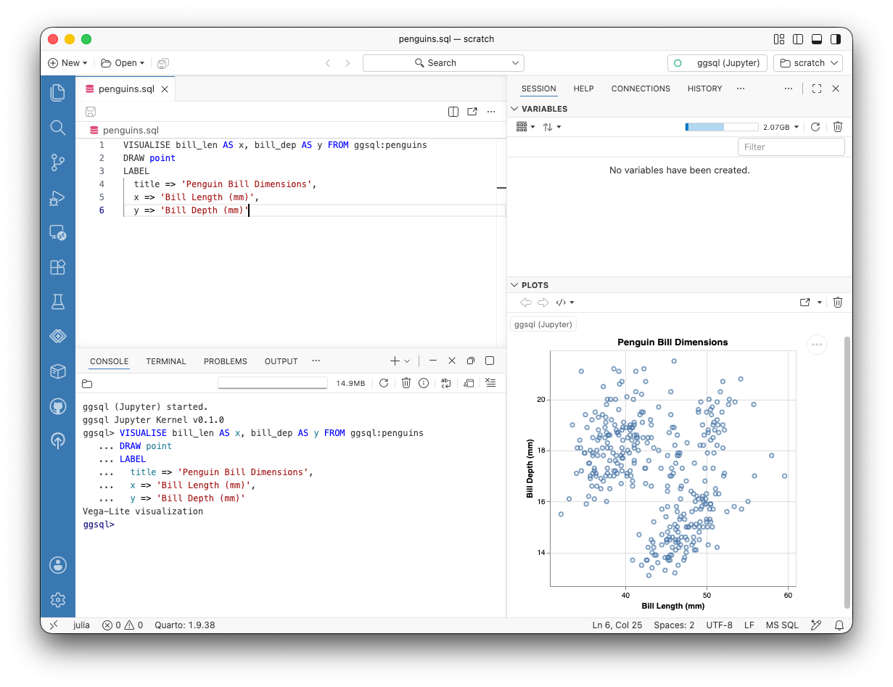
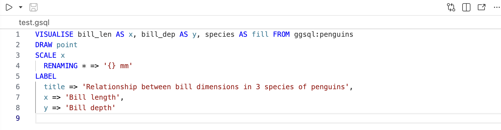

# NOTES TO SELF
1. i'm not consistent about bold/highlight of some of the words throughout: ggsql, R, Python, even CONSOLE vs Console...  Also, I need to add some attributions to the Posit folks. The image and the penguins code.

2. I wonder if it is worth creating a remote database via sqlite so that we can demo how ggsql would connect to a remote databse?  Right now, all the public databases are mysql, and ggsql doesn't connect to mysql.

3. With the knitr kernel (instead of the jupyter kernel), you can only use ggsql like you'd use dbplyr.  All `{r}` cells, no `{ggsql}` cells  (look in the repo at the file called "ggsql_wR.qmd"). I'm not 100% sure about this, but I don't know if it is a direction we want to go anyway. Here is why I don't like the path: if you are happy using `{r}` (and knitr) then you can already use `{sql}` chunks (see our tutorial on SQL in R 3 ways). So why in the world would you even use ggsql?  See the file I was playing around with in the repo called ggsql_wR.qmd.

4. If you want to use it in RStudio, you can use the ggsql R package with `ggsql_execute()` etc. See #3 above for why I don't think we should go that direction.  I **think**, although I haven't tried it out, that if you use a Jupyter notebook in RStudio, then everything below will work (however, you can't install the ggsql extension).

----------------------


For ggsql, the use case is actually for folks who do NOT want to use either R or Python, but just the SQL on its own. You can do the SQL queries and make visualizations without R or Python running at all, like this:




There is no R or Python running at all in the image above. You can author Quarto documents that use ggsql as the kernel and do not use either an R or a Python kernel.

## Installing

Start by installing ggsql: https://ggsql.org/get_started/installation.html

You'll need to also install ggsql in the extensions view in Positron (the icon on the left sidebar that looks like four squares) and type "ggsql".

### running ggsql

Once ggsql is running in the extensions, ggsql should be an option in the CONSOLE.  Along with the ability to run in the console, any .gsql file should render.  For example, try running the following file (or type the code into the console!):



Notice that the file looks similar to a .R or .py file. There is no narrative mixed in with the code, and when you run the code, the output and images will not render within the file.

### running Quarto with ggsql

In order to run ggsql in Quarto, you need to have a Jupyter engine running. (Unlike R in Quarto, which is handled by a knitr engine.) That is, the Jupyter engine via a Python virtual environment. Below, we've provided vocabulary and descriptions of the process, which might help understand what is happening with different kernels and engines in Positron.

Layer 1. the language / kernel that actually exectues the code. R or Python or ggsql. These are called **kernel**s.

Layer 2. Quarto's internal machinery for talking to the kernel. Quarto calls this an "execution engine" and there are only two of them.

  - the knitr engine which is used for `{r}` cells  (also `{bash}`, `{sql}` and `{python}` via **reticulate**)
  - the Jupyter engine which is used for `{python}`, `{ggsql}`, `{julia}` etc. cells (or `{r}` via **rpy2**)

Layer 3. Quarto which is the document / rendering tool itself. Quarto reads the .qmd file, decides which engine (from Layer 2) to execute, and brings together all the pieces of the analysis. Quarto can only get to Layer 1 via Layer 2. Quarto chooses exactly one Layer 2 engine per document (knitr or Jupyter but not both).


# Running ggsql

The motivation for using SQL typically derives from working with large and/or remote databases. Therefore, where the data live is an integral part of working with ggsql.


## Data from ggsql

The first ggsql example runs SQL code in a `{ggsql}` cell chunk. Note that the data come directly (and automatically) from the ggsql kernel.

```{ggsql}
#| echo: fenced

VISUALISE bill_len AS x, bill_dep AS y, species AS fill FROM ggsql:penguins
DRAW point
SCALE x 
  RENAMING * => '{} mm'
LABEL
  title => 'Relationship between bill dimensions in 3 species of penguins',
  x => 'Bill length',
  y => 'Bill depth'
```


 
## Small data in memory

Rather than connecting to an external file or database, DuckDB can build a table directly from literal values written into the query itself, using a `VALUES` list. This creates a small in-memory table with no CSV, no R, and no Python involved at all. Note that DuckDB is `ggsql`'s default reader (in-memory).

```{ggsql}
#| echo: fenced

CREATE OR REPLACE TABLE fruit_sales AS
SELECT * FROM (
  VALUES
    ('apple',  12, 'west'),
    ('apple',  9,  'east'),
    ('banana', 18, 'west'),
    ('banana', 7,  'east'),
    ('cherry', 4,  'west'),
    ('cherry', 15, 'east')
) AS t(fruit, units_sold, region);
 
VISUALISE fruit AS x, units_sold AS y, region AS fill FROM fruit_sales
DRAW bar
  SETTING position => 'dodge'
LABEL
  title => 'Units sold by fruit and region',
  x => 'Fruit',
  y => 'Units sold'
```
 
 

## Local DuckDB connection

Right now, **ggsql** connects only to `duckdb`, `sqlite`, and `odbc`. There are no native connections available to `mysql` or `mariadb`. I don't know of any publicly available remote data using `sqlite` or `odbc`. DuckDB is the default reader, and we can load any csv file into a local DuckDB database.

```{ggsql}
#| echo: fenced

INSTALL httpfs;
LOAD httpfs;
CREATE OR REPLACE TABLE legodata AS
SELECT * FROM read_csv_auto('https://www.openintro.org/data/csv/lego_population.csv',
types = {'price': 'DOUBLE', 'unique_pieces': 'DOUBLE'},
nullstr = 'NA') 
WHERE theme IN ('City', 'Friends', 'Marvel')
```


```{ggsql}
#| echo: fenced

VISUALISE price AS x, unique_pieces AS y, theme AS color FROM legodata
DRAW point
LABEL
  title => 'LEGO set price vs. unique pieces, by theme',
  x => 'Price',
  y => 'Unique pieces'
```


## Remote connection

We need to find or set-up a sqlite public database! 


